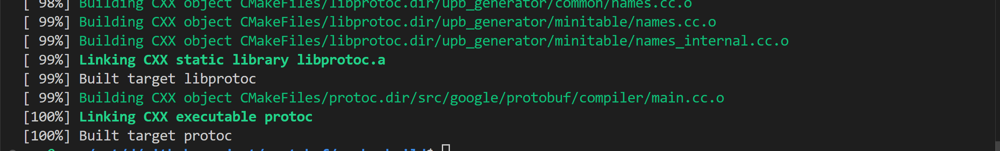
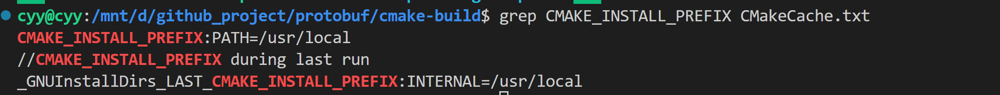
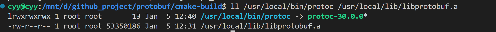

## C++protobuf: 基础和构建项目流程
该文章介绍了使用cmake工具安装protobuf的步骤，以及给出一个简单的使用C++ protobuf例子，并介绍如果使用cmake对proto文件进行管理和自动生成，并给出一个完整的项目配置结构和流程。

## 背景知识：

以下测试和操作需要对cmake基础认识，若有不熟悉cmake指令，可以在以下cmake api文档进行查找[CMake Reference Documentation — CMake 3.31.3 Documentation](https://cmake.org/cmake/help/latest/index.html)

## 安装环境

测试环境：5.15.167.4-microsoft-standard-WSL2（Ubuntu24.04)

protobuf项目地址：[protocolbuffers/protobuf: Protocol Buffers - Google's data interchange format](https://github.com/protocolbuffers/protobuf)

官方安装指引：[protobuf/src at main · protocolbuffers/protobuf](https://github.com/protocolbuffers/protobuf/tree/main/src)

官方指引采用bazel构建，这里采用cmake进行构建

在构建protobuf之前，需要先安装：cmake、git、g++、Abseil

+ 安装 g++ 、 git、cmake

```bash
sudo apt-get install g++ git cmake
```

+ 安装Abseil

```bash
# 网络环境不好情况下增加 depth=1参数，这样下载不会包含历史版本信息，会减少下载大小
git clone depth=1 https://github.com/abseil/abseil-cpp.git
cd abseil-cpp
make -j 6 #采用wsl2编译时候，wsl2 I/O性能较差，这里实际增加太多并行导致I/O竞争写入效率更差
sudo make install
```

+ 安装 protobuf

```bash
# 同样加入depth=1参数，减少下载内容大小
git clone depth=1 https://github.com/protocolbuffers/protobuf.git
cd protobuf
git submodule update --init --recursive #下载protobuf依赖的第三方库
mkdir cmake-build
cd cmake-build
cmake -DCMAKE_BUILD_TYPE=Release \
      -Dprotobuf_WITH_ZLIB=OFF \
      -Dprotobuf_BUILD_TESTS=OFF \
      ..
make -j 8 #为采用的wsl2环境，I/O性能较差，并发高反而增加I/O竞争，降低效率。服务器直接make -j
sudo make install
```

+ -DCMAKE_BUILD_TYPE：指定构建类型为Release
+ -Dprotobuf_WITH_ZLIB=OFF: 不使用zlib库
+ -Dprotobuf_BUILD_TESTS=OFF: 不构建测试，构建测试需要使用GTest，需要额外下载。



+ libprotoc.a：C++ 运行时链接的静态库 protoc：proto文件解释器，将proto文件生成.h，.cc文件后面会介绍使用

+ sudo make install 默认安装在/usr/local路径下，可以通过 grep CMAKE_INSTALL_PREFIX CMakeCache.txt 进行查看


目标结果检查

至此protobuf安装完全，以下为例子使用

## protobuf 简单使用

例子来自：[Protocol Buffer Basics: C++ | Protocol Buffers Documentation](https://protobuf.dev/getting-started/cpptutorial/)

这里只做一个简易的完整流程：写proto文件-->生成.h，.cc文件--->程序使用生成的源文件

1. 创建一个proto文件Person.proto

```protobuf
syntax= "proto3";

package tutorial;

message Person {
  string name = 1;
  int32 id = 2;
  string email = 3;
}
```

+ proto分为proto2和proto3，syntax= "proto3" 指定使用proto3，没写默认使用proto2。proto3向前兼容
+ package tutorial，生成的.h，.cpp文件命名空间为tutorial
+ message Person { .... } 生一个消息对象，包含定义的属性
+ string name = 1;
  + string: 字段类型，表示一个字符串
  + name: 字段名称
  + 1：字段编号，用来唯一识别字段

2. 使用已经安装的protoc工具生成Person.pb.h，Person.pb.cc文件，包含了Person消息对象属性设置函数和系列化函数，更加详细在这里可以查找[Protocol Buffers Documentation](https://protobuf.dev/)

```sh
protoc --cpp_out=./ -I=./Person.proto
```

+ --cpp_out 指向生成的h，cc文件要存放路径
+ -I proto文件路径

执行完在当前目录会有Person.pb.h和Person.ph.cc文件生成

3. 编程程序使用生成的proto，在当前路径下创建main.cpp文件，输入以下内容

```cpp
#include <fstream>
#include "Person.pb.h"

int main()
{
    tutorial::Person person{};
    person.set_name("proto_name");
    person.set_id(1);
    person.set_email("email");

    //序列化到文件上
    std::fstream output("person.bin", 
                        std::ios::out | 
                        std::ios::trunc |
                        std::ios::binary);
    
    if(!person.SerializePartialToOstream(&output)) {
        std::cerr << "Failed to write person" << std::endl;
        return -1;
    }
    output.close(); //注意：需要将写入缓存刷到磁盘上，后续才可以读到

    //从文件内容反序列化
    std::fstream input("person.bin", 
                          std::ios::in |
                          std::ios::binary);
    tutorial::Person read_person{};
    if(!read_person.ParseFromIstream(&input)) {
        std::cerr << "Failer to parse person" << std::endl;
        return -1;
    }

    std::cout << "name: " << read_person.name() << std::endl;
    std::cout << "id: " << read_person.id() << std::endl;
    std::cout << "email: " << read_person.email() << std::endl;
    return 0;
}

```

4. 使用cmake构建程序，这里因为protobuf依赖abseil库，使用cmake中的find_package，可以自动处理依赖，不需要手动指定protobuf其他依赖

​	在当前目录下创建CMakeLists.txt文件，将下面内容输入到CMakeLists.txt文件

```cmake
cmake_minimum_required(VERSION 3.22)

project(test)

find_package(protobuf REQUIRED)

add_executable(test main.cpp Person.pb.cc)
target_link_libraries(test protobuf::libprotobuf)
```

5. 创建构建目录build，mkdir build执行以下命令进行构建生成目标程序test
   + cd build && cmake .. && make -j
6. ./test会有以下输出

```text
name: proto_name
id: 1
email: email
```

## 使用cmake自动生成proto目标文件

在上面的使用过程，当我们新增或者修改proto文件时，都需要执行protoc命令去指定文件和指定生成目录，当然在这里可以简单用一个shell脚本文件保存执行命令，每次更新手动执行一次就可以，但是存在更新了proto文件忘记更新生成文件时，如果在编译和链接阶段没有检查出来时上线会导致意想不到事情。这里使用的cmake工具来构建工程，因此也可以使用cmake来执行protoc生成文件，在每次执行构建的时候，按照当前最新的proto文件生成文件进行构建。

调整项目代码目录结构：新增src/proto目录，用来管理proto描述文件，调整完结构如下
```sh
src/
├── CMakeLists.txt
├── main.cpp
└── proto
    └── Person.proto
```

修改main关于proto文件引入路径

```cpp
#include <fstream>
#include <proto/Person.pb.h> # 修改此位置
```

在cmake文件，设置在构建目录build/proto生成proto目标文件，并添加到include路径

```cmake
cmake_minimum_required(VERSION 3.13)

project(test)

set(CMAKE_EXPORT_COMPILE_COMMANDS ON)
# Find required protobuf package
find_package(protobuf CONFIG REQUIRED)

find_package(Protobuf REQUIRED)
include_directories(${CMAKE_CURRENT_BINARY_DIR})

file(GLOB PROTO_FILES "proto/*.proto")
add_library(service_proto OBJECT ${PROTO_FILES})


protobuf_generate(
    TARGET service_proto
    LANGUAGE cpp
)

add_executable(test main.cpp)
target_link_libraries(test service_proto protobuf::libprotobuf)
```

+ protobuf_generate[^1] 在cmake 3.13版本才支持，cmake版本最低3.13
+ set(CMAKE_EXPORT_COMPILE_COMMANDS ON) 在构建目录下生成compiler_command.json文件，用于语法插件提示
+ find_package(protobuf CONFIG REQUIRED) 查找libprotobuf.a库，并自动处理其他依赖
+ find_package(Protobuf REQUIRED)  导入支持 protobuf_generate函数
+ include_directories(${CMAKE_CURRENT_BINARY_DIR}) 将当前构建目录加入头文件查找目录
+ file(GLOB PROTO_FILES "proto/*.proto") 遍历proto目录下所有后缀为proto的文件
+ add_library(service_proto OBJECT ${PROTO_FILES}) 增加proto生成目标service_proto，这里的目标可以认为是Makefile文件中的目标，后续可以单独执行make service_proto生成proto目标文件而不需要编译构建程序
+ protobuf_generate(
      TARGET service_proto
      LANGUAGE cpp
  )  生成 cpp 语言的proto目标文件
+ target_link_libraries(test service_proto protobuf::libprotobuf) 需要将proto生成目标service_proto链接上

在src同级目录下创建构建目录build，并进行构建

cmake -S src -B build && cd build && make -j

项目最后配置compiler_command.json，下面是vscode的配置流程

在src同级目录下创建vscode配置目录.vscode，执行Ctrl+Shift+p，打开C++配置json文件。或者自己创建c_cpp_properties.json

增加compileCommands的属性执行生成的compiler_commands.json文件

```json
{
    "configurations": [
        {
            "name": "Linux",
            "includePath": [
                "${workspaceFolder}/**"
            ],
            "defines": [],
            "compilerPath": "/usr/bin/gcc",
            "cStandard": "c17",
            "cppStandard": "gnu++17",
            "intelliSenseMode": "linux-gcc-x64",
            "compileCommands": "${workspaceFolder}/build/compile_commands.json"
        }
    ],
    "version": 4
}
```

至此一个简单但完整的项目构建流程完成

以下的最后生成的全部文件目录结构，去掉cmake生成的缓存文件
```sh
.
├── .vscode
│   └── c_cpp_properties.json
├── build
│   ├── compile_commands.json
│   ├── proto
│   │   ├── Person.pb.cc
│   │   └── Person.pb.h
│   └── test
└── src
    ├── CMakeLists.txt
    ├── main.cpp
    └── proto
        └── Person.proto
```
## 引用

[^1]:[FindProtobuf — CMake 3.31.3 Documentation](https://cmake.org/cmake/help/latest/module/FindProtobuf.html#command:protobuf_generate_cpp)