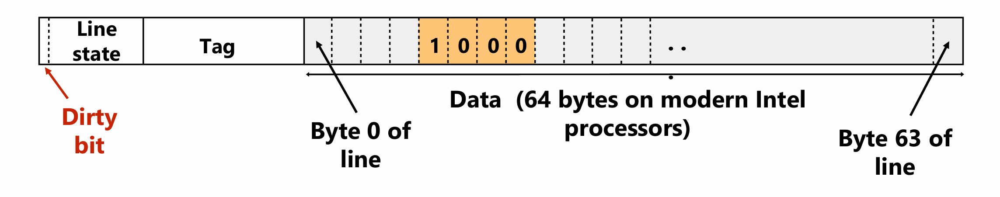
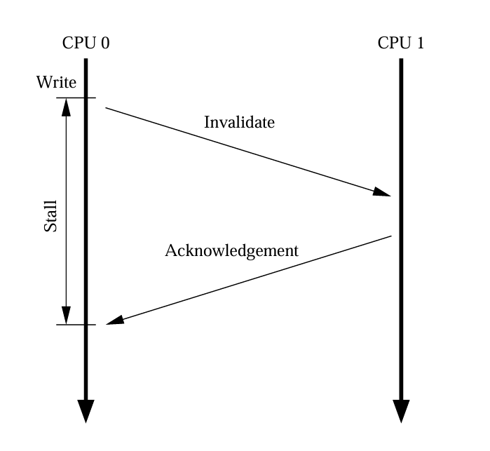
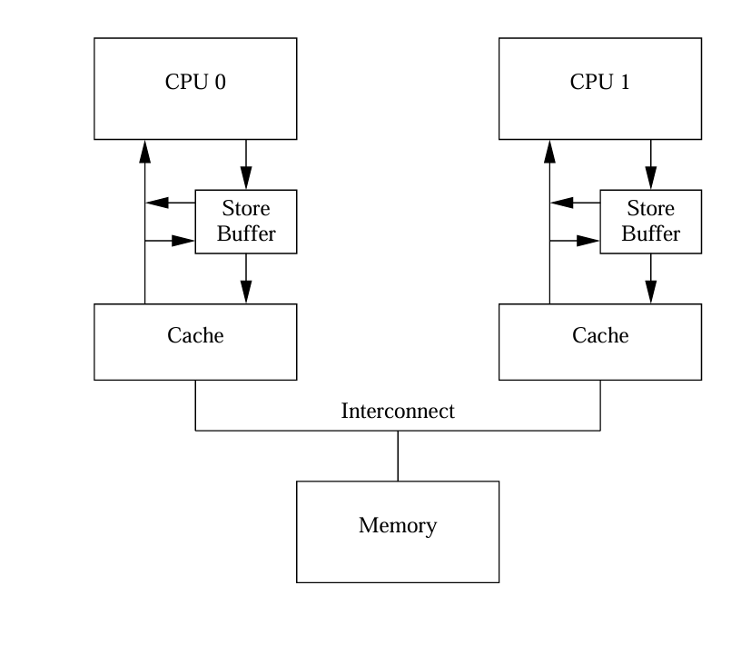
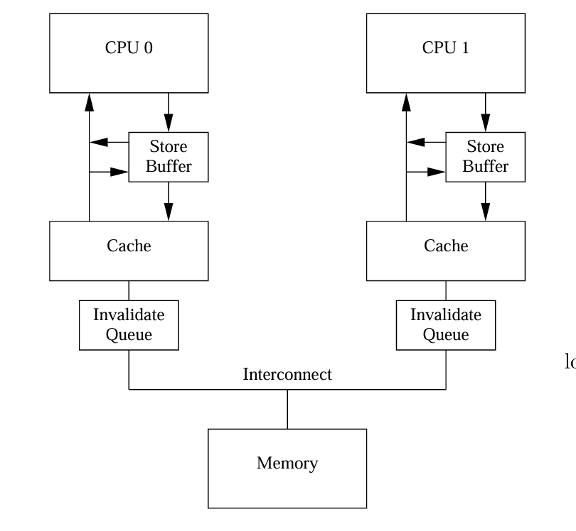
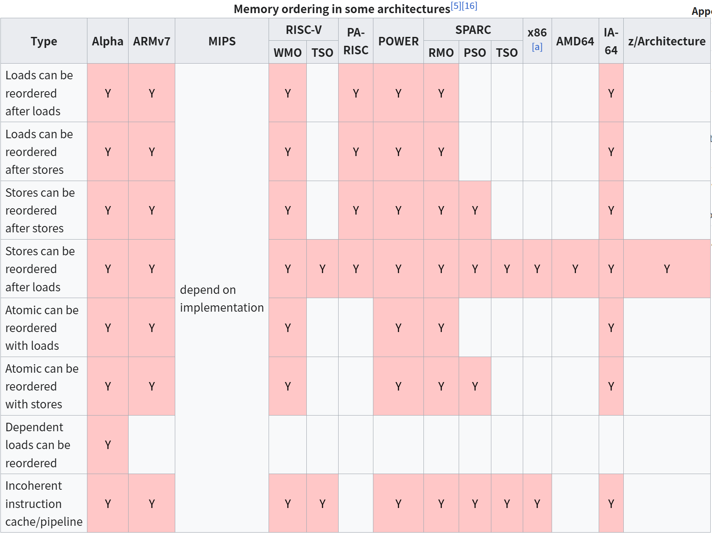

# C++并发设计：背景基础知识-深入理解内存序
该文章主要对并发设计中涉及同步知识进行总结，包括：__CPU缓存结构__，__缓存一致性协议MESI__，__指令重排和乱序执行__，__内存屏障__。并给出不同CPU的共享变量不同步例子，以及使用内存屏障进行解决。
当前文章的涉及到缓存一致性协议和缓存之间通信同步的例子均来自Memory Barriers: a Hardware View for Software Hackers论文[^3]，推荐大家去看原论文。

## CPU缓存结构



现代的cpu执行一条指令花费不到1ns，而从内存中加载数据需要几十ns，大部分的时间都在等待加载数据，因此在CPU和内存之间增加了多级缓存

越接近CPU的缓存速度越快，容量越小，以下是对应的测试数据[^2]

+ L1 cache: 1ns to 2ns (2-4 cycles)
+ L2 cache: 3ns to 5ns (6-10 cycles)
+ L3 cache: 12ns to 20ns (24-40 cycles)
+ RAM: 60ns (120 cycles)

## Cache Line

cache line 是 cache与内存数据交换的最小单位，一般为32字节或64字节。cache line存储从内存加载的数据，以及数据的地址和数据当前的状态。

cache line的数据结构当CPU从cache中读取数据的时候，会比较地址是否相同，如果相同则检查cache的状态，无效则从内存中加载数据。

cache line的数据结构



​												图片来源：CMU 15-418/618 Spring 2020 Lecture 10

+ Line state 存放当前缓存行的状态（MESI状态或者其他缓存一致性协议实现状态），Dirty bit用来判断当前缓存是否有效
+ Data 存放当前缓存的数据内容，现代计算大多数是64字节
+ Tag 用于标识数据来着哪个内存地址，当CPU读取或写入特定地址的数据时，可以进行比较判断是否命中缓存

## 缓存一致性协议MESI

多级缓存，使得每个CPU都有独立的缓存，使得在同一时刻，每个CPU缓存对同一地址的数据都存在副本，因此为了避免数据不一致或丢失数据，引入缓存一致性协议管理多核CPU缓存行(cache line)的状态。

### MESI 状态

__MESI__ 的状态： modified、exclusive、shared、invalid

+ __已修改modified__：当前CPU cache拥有最新的数据（cache line）且未更新到内存中，如果别的CPU内核要读取主存这块数据时，改缓存行必须回写到主存，状态变为共享。
+ __独占exclusive__:  缓存行只在当前缓存中，当是干净的，没有修改与主存一致。当别的缓存读取它时，状态变为 __shared__，当前写数据时，变为 __modify__ 状态。
+ __共享shared__: 缓存行也存在与其他缓存中且是干净的。缓存可以随时抛弃，不需要回写。
+ __无效invalid__: 缓存行是无效的。

### MESI 操作

总线对缓存的请求：

| 操作         | 操作描述                                                     |
| ------------ | ------------------------------------------------------------ |
| __BusRd__    | 向其他处理读一个缓存行的请求                                 |
| __BusRdX__   | 向其他处理写一个缓存行请求，当前处理器并__不拥有该缓存行__，其他处理器存在有效缓存行，其中一个会响应该请求并发送数。 |
| __BusUpgr__  | 当前处理拥有该缓存行，要进行写时向其他处理器发出请求写信号。 |
| __Flush__    | 将自身的缓存行回写到内存中的请求。                           |
| __FlushOpt__ | 将自身的缓存行发送到另一个处理的请求。                       |

cache line 各个状态对读写操作的响应

<table>
    <capital></capital>
    <tr>
    	<th>初始状态</th>
        <th>操作</th>
        <th>响应</th>
    </tr>
    <!-- 第一行的数据 -->
    <tr>
    	<td rowspan=2>invalid</td>
        <td>read</td>
        <td>给总线发送BusRd<br>其他处理器看到BusRd，检查自己是否有有效的数据副本，存在缓存时，通知发出请求的缓存，并把状态改为shared<br>如果其他处理器都没有有效副本，则从主存获取数据，状态设置为exclusive</td>
    </tr>
    <!-- 第二行的数据-->
    <tr>
        <td>write</td>
        <td>给总线发送BusRdX<br>
			如果其他处理器有有效的副本（exclusive，shared），从其中一个缓存发出数据，所有有效副本的状态改为invalid<br>
			其他处理没有有效的副本，从主存获取数据<br>
			当前处理器缓存行状态改为modify<br>
            向缓存块写入修改后的值<br>
        </td>
    </tr>
    <!-- 第三行的数据-->
    <tr>
    	<td rowspan=2>exclusive</td>
        <td>read</td>
        <td>无总线事务生成<br>
            状态保持不变<br>
            读操作作为缓存命中<br>
        </td>
    </tr>
    <!-- 第四行的数据-->
    <tr>
        <td>write</td>
        <td>无总线事务生成<br>
            状态改为modify<br>
			向缓存块中写入修改后的值<br>
        </td>
    </tr>
    <!-- 第五行数据-->
    <tr>
    	<td rowspan=2>shared</td>
        <td>read</td>
        <td>总线事务生成<br>
            状态保持不变<br>
            读操作缓存命中<br>
        </td>
    </tr>
    <!-- 第六行数据-->
    <tr>
        <td>write</td>
        <td>向总线事务发出BusUpgr信号<br>
            状态改为modify<br>
            其他处理器缓存看到BusUpgr信号，标记其副本为invalid<br>
            更新缓存值<br>
        </td>
    </tr>
    <!-- 第七行数据-->
    <tr>
    	<td rowspan=2>modify</td>
        <td>read</td>
        <td>无总线事务生成<br>
			状态保持不变<br>
            读操作缓存命中<br>
        </td>
    </tr>
    <!-- 第八行数据-->
    <tr>
        <td>write</td>
        <td>无总线事务生成<br>
            状态保持不变<br>
            写操作命中<br>
        </td>
    </tr>
</table>

### MESI 总结

+ 在 __exclusive__，__modify__ 状态下 __读写__ 都会命中缓存，并不会产生总线事务，在 __shared__ 状态下 __读__ 取操作也会命中缓存且不会产生总线事务

​	在这种情况下的效率是最高的。

## Stores Buffers

当cache line状态不为 __modify__ 、__exclusive__ 时，对cache line进行写请求流程



可以看到CPU0在写请求时，先发送请求到CPU1上，CPU1存在缓存的值，讲CPU1的cahce line状态设置为 __invalid__ 后返回响应缓存的值，

CPU0接收到响应再进行写入cache line的值。可以看到在这里写时需要等待"stall"时间，而在这里无论CUP0接收到什么值都会进行覆盖写入，因此在CPU和Cahe之间增加一个 __Store Buffer__，先将要写入的值存在Store Buffer中，等到接收到CPU1的响应，再将值更新到缓存上。上面写入的流程就变为：CPU0发送请求到总线，直接将值写入到 __Store Buffer__ 中，然后不用等待接着执行下一条指令，等到接收到其他CPU的响应时，再将 __Store Buffer__ 的值写入到Cache中。



增加了 __Store Buffer__ 的读取流程变成，CPU会优先在 __Store Buffer（最新修改值）__ 中查找，然后再从cache中进行查找。

引入 __Store Buffer__ 会带来多个处理器同步问题：如以下代码

```C
//foo 运行在CPU 0上
void foo(void)
{
    a = 1;
    b = 1;
}

//bar 运行在CPU 1上
void bar(void)
{
    while(b == 0) continue;
    assert(a == 1);
}
```

假设变量a = 0只存在CPU1的Cache（mesi modify或exclusive状态）上，而b只存在CPU0的Cache(mesi modify或exclusive 状态）上，存在以下执行顺序：

1. CPU0 执行 a = 1，当前Cache没有存在a的缓存行，发送 __BusRdX__ 总线请求，并将a = 1的值存在到 __Store Buffer__
2. CPU1 执行while(b == 0) continue，b不存在CPU1的Cache中，因此发送 __BusRd__ 总线请求
3. CPU0 执行 b = 1，b的值只存在CPU0缓存里（__modify__，__exclusive__ 状态)，因此直接将值更新到Cache中，mesi状态更改未 __modify__
4. CPU0 接收到CPU1发送的 __BusRd__ 总线请求，将b的值发送到CPU1，并将状态修改为 __shared__ 状态
5. CPU1 接收到 CPU0响应的b = 1，将b的值加入到Cache中，设置状态为 __shared__
6. CPU1 此时b = 1 不满足while(b == 0), 接着执行assert(a == 1)，此时CPU1缓存中存在a的“旧值 a == 0”，因此断言失败（程序core)，因为这时a的最新在CPU0的Store Buffer中，同时CPU1还没有接收到关于a的 __BusRdx__ 请求无效a的缓存消息（note：现代计算机CPU总线一般是并行，不能保证MESI协议消息的有序性）。
7. CPU1 此时才接收到第一步CPU0发送的 __BusRdX__ 请求，将a的状态设置为 __invalid__，但这时程序已经失败退出了
8. 假设没有断言，这时CPU0 接收到CPU1的关于a的响应，应用 __Store Buffer__ 的a的值到Cache中。

硬件并不会去解决以上问题，因为CPU并不清楚哪些变量会存在关联，例如：变量a只是当个CPU上访问，那么就不会出现上面的同步问题，Store Buffer能够避免从内存加载数据到缓存的等待时间，等到加载到缓存再从Store Buffer中将a的值更新到缓存。为了解决上面的问题，增加 __内存屏障__ 指令允许软件开发者告知CPU变量之间的关系，从而达到不同CPU同步。

## 内存屏障

内存屏障，也称内存栅栏，内存栅障，屏障指令等，是一类同步屏障指令，它使得CPU或编译器在对内存进行操作的时候，严格按照一定的顺序来执行，也就是说在内存屏障之前的指令和之后的指令不会由于系统优化等原因而导致乱序[^1]。将 __Store Buffer__ 中的例子加上  __内存屏障__ 来进行修改

### smp_mb

```c
// foo函数在CPU0上运行
void foo(void)
{
	a = 1;
    smp_mb();
    b = 1;
}
// far函数在CPU1上运行
void far(void)
{
    while(b == 0) continue;
    assert(a == 1);
}
```

增加了这条指令后，上诉程序执行流程变为（假设变量a = 0只存在CPU1的Cache（mesi modify或exclusive状态）上，而b只存在CPU0的Cache(mesi modify或exclusive 状态）：

1. CPU0 执行 a = 1,  cache line不在CPU0的缓存中，因此CPU0将a = 1值存储到 __Store Buffer__ 中，并发送 __BusRdX__ 总线请求
2. CPU1 执行 while(b == 0) continue，b不在CPU1的缓存中，因此发送 __BusRd__ 总线请求
3. __CPU0 执行 smp_mb() 标记当前在 Store Buffer中所有的"entrires"（如 a = 1)__
4. __CPU0 执行 b = 1，b存在CPU0的缓存里面(modify，exclusive），但是当前Store Buffer中存在被标记的"entries"，因此也将 "b = 1"存储在Store buffer中（b = 1 不会被标记)__
5. CPU0 接收到CPU1发送的 __BusRd__ 总线请求，将 __Cache__ 中b（__此时Cache中b的值为0__）的值发送到CPU1，并将状态修改为 __shared__ 状态
6. CPU 1 接收到 CPU0发送过来b的值，将b = 0的值加入到自己的缓存里面，设置状态为 __shared__ 状态
7. CPU 1 接收到 CPU0发送关于a的 __BusRdX__ 总线请求，因此发送当前的Cache中a的值，并将状态设置为 __invalid__
8. CPU0 接收到CPU1发送a的值，将存储在 __Store Buffer__ 中a的最新值覆盖在Cache中，并设置状态为 __modify__
9. CPU 0 因为当前 __Store Buffer__ 中只有a被 __smp_mb__ 指令标记，b在 __Store Buffer__ 并没有被标记，因此会继续更新b，再更新到Cache之前，因为Cache中b的状态为 __shared__，因此先给CPU1发送 __BusUpgr__ 总线请求
10. CPU1 接收到 __BufUpgr__ 请求，将Cache中b设置为 __invalid__ 状态并发送 __“acknowledgement"__ 信息给CPU0
11. CPU1 执行while(b == 0) continue，此时b在CPU1的缓存中为 __invalid__ 的状态，因此发送 __BusRd__ 总线请求
12. CPU0 接收到来着CPU1的 __“acknowledgement"__，将 __Store Buffer__ 中b应用到Cache中，并设置状态为 __exclusive__
13. CPU0 接收到来着CPU1的关于b的 __BufUpgr__ 请求，将b状态设置为 __shared__ 并将值发送给CPU1
14. CPU1 接收到来着CPU0 b的值，将存储在Cache中，并设置状态为 __shared__ 此时b的值为1
15. CPU1 加载到b的值，继续执行while(b == 0) continue; b当前等于1，不满足条件退出循环
16. CPU1 执行执行assert(a == 1)，此时a不存在CPU1的缓存中，发送 __BusRd__ 请求
17. CPU0 接收到 __BusRd__ 请求，将a更新到内存到，并将值发送给CPU1
18. CPU1 获取a的值为1，执行assert(a == 1)

__内存屏障__ 在这里的作用：当CPU1中获取到b = 1的值时，保证在CPU0 b = 1之前的数据修改（这里是a =1)是可见的，因此CPU1退出循环assert(a == 1) 恒为真。

也就是保证了smp_mb之前和之后的写操作不会出现重排，smp_mb同样能保证读操作不会出现重排，下面进行讨论。

## 无效队列

每次将Store Buffer中的值更新到Cache中，都需要发送请求到其他CPU，使其缓存失效，接收到响应再进行更新，因为Store Buffer相对很小，执行几条写指令且刚好不在缓存中，那么Store Buffer存满需要等待将值更新到Cache中再继续执行指令，这样每执行几个指令就会进入等待，为了减少等待的时间，每个CPU都增加一个无效队列。



当 __Invalidate Queue(无效队列）__ 接收到一条其他CPU写缓存使其无效的消息时，会立即回复"ack"（acknowledge message）消息，而当前CPU若再处理其他缓存，则可以延迟处理无效队列中的消息。（插一句：这里不同CPU之间的数据同步跟数据库主备同步redo log的延迟应用很像，果然好的设计总是相通的 :) ）。

放置一条无效消息在无效队列，CPU并不会马上处理无效cahce line，只有当无效消息被处理时，才会对对应的cache line进行操作，并发送MESI协议消息。

当加入这一变化的时候，也会带来执行顺序的改变，以上面代码为例

```C
// foo函数在CPU0上运行
void foo(void)
{
	a = 1;
    smp_mb();
    b = 1;
}
// far函数在CPU1上运行
void far(void)
{
    while(b == 0) continue;
    assert(a == 1);
}
```

假设当前 a 和 b 的被初始化为0，a在CPU0和CPU1 Cache中，状态为 __shared__，只有b在CPU 0的Cache中，状态为 __modify__ 或 __exclusive__

可能会存在以下的执行顺序：

1. CPU0 执行到 a = 1指令，a存在CPU0的Cache中，因此发送”无效“消息到CPU1
2. CPU1 执行 while(b == 0) continue；指令，b 不在CPU1的Cache里，因此发送请求读指令 __BusRd__
3. CPU0 接收到关于a无效的”ack“消息，将a更新在Cache中，此时smp_mb不需要执行操作，因为这里只有a的写操作，没有其他写操作。
4. CPU0 执行b = 1，b只存在CPU0的Cache中，因此直接在Cache中进行更新值，状态为 __modify__
5. CPU0 接收到CPU1对于b的读请求，因此将新值b = 1发送给CPU1，并将状态设置为 __shared__
6. CPU1 接收到b的值，将其更新到Cache中，设置状态为 __shared__
7. CPU1 加载到b的值，执行while(b == 0) continue; 退出循环
8. CPU1 执行 assert(a == 1)，此时a在CPU1的Cache中值为0，因此断言失败，因为关于a无效的消息还在无效队列中，未被处理

__内存屏障__ 除了会影响到CPU于Store Buffer之间的操作，也会对Invalidate Queue操作进行影响

当执行到 __内存屏障__ 时，会标记所有在Invalidate Queue的所有条目，等待直到处理完所有Invalidate Queue所有条目，并进行应用到Cache中。

因此上面的代码可以修改成以下形式

```C
// foo函数在CPU0上运行
void foo(void)
{
    a  = 1;
    smp_mb();
    b = 1;
}

// far函数在CPU1上运行
void bar(void)
{
    while(b == 0) continue;
    smp_mb();//额外增加内存屏障，等待处理Invalidate Queue条目
    assert(a == 1);
}
```

同样假设当前 a 和 b 的被初始化为0，a在CPU0和CPU1 Cache中，状态为 __shared__，只有b在CPU 0的Cache中，状态为 __modify__ 或 __exclusive__

以上的代码执行流程有可能为以下形式：

1. CPU0 执行 a = 1，因为a在CPU1和CPU0Cache中，状态为 __shared__，先将a = 1存储在Store Buffer中，并发送“invalidate" 消息给CPU1
2. CPU1 执行 while(b == 0) continue；指令，b 不在CPU1的Cache里，因此发送请求读指令
3. CPU1 接收到"invalidate"消息加入到 Invalidate Queue中，并进行响应“ack"
4. CPU0 接收到来自CPU1的响应，将Store Buffer中的值a更新到Cache中，smp_mb不用操作，因为在这上面的操作已经将a更新到Cache中
5. CPU0 执行 b = 1，b在CPU0的Cache中(__modify__ 或 __exclusive__)，将新值直接更新到Cache中
6. CPU0 接收到CPU1的读消息，将Cache中的b的值发送给CPU1，状态设置为 __shared__
7. CPU1 接收到CPU0发送过来b的值，更新到Cache中
8. CPU1 获取b = 1，退出while(b == 0) continue的循环
9. CPU1 执行__内存屏障__smp_mb，此时必须等待处理Invalidate Queue中所有消息
10. CPU1 此时执行处理Invalidate Queue中a"invalidate"消息，将a在Cache中设置为 __invalid__，处理完Invalidate Queue消息继续执行指令
11. CPU1 执行assert(a == 1)，a不再Cache中(__invalid__)，发送读请求给CPU0
12. CPU0 接收到CPU1的读请求，将a的最新值发送给CPU1
13. CPU1 接收到a的值，将其更新到Cache中，并读取，此时assert(a == 1)的断言成功。

## 读内存屏障和写内存屏障

在这上面所描述，__内存屏障__ 使用标记 __Store Buffer 和 Invalidate Queue__ 中的所有条目，而在代码中foo()函数并不需要对 Invalidate Queue队列进行限制，在bar函数中也不需要对Store Buffer进行限制，因此许多CPU架构提供弱内存屏障分为 __读内存屏障__ 和 __写内存屏障__，分别对Invalidate Queue和Store Buffer进行作用。

上面的代码可以更新为以下形式

```C
// foo函数在CPU0上运行
void foo(void)
{
    a  = 1;
    smp_wmb();//标记Store Buffer中的所有条目，在这之后的写操作也会加入Store Buffer保证写顺序可见性
    b = 1;
}

// far函数在CPU1上运行
void bar(void)
{
    while(b == 0) continue;
    smp_rmb();//在执行下一条指令时，先处理完Invalidate Queue中的无效消息,以保证读取到最新值
    assert(a == 1);
}
```

## 内存序

由于Store Buffer和Invalidate Queue的存在，允许CPU指令乱序执行，即写操作可以提前完成，而读操作可能会读取到旧的数据。这种行为被称为 __乱序执行__，对单CPU逻辑不会产生影响，但在跨CPU共享变量同步就需要内存屏障来保证某些操作的顺序。各个CPU架构对于内存的支持不太一样，下面的CPU架构对应内存序支持。

## 各个CPU架构对于内存序的支持



​								 					图片来源：Memory ordering wiki[^4]

这里可以看到X86服务器，本身就对CPU 读写指令做了限制，写写不允许重排，读读也是不允许重排。这里可以通过linux内核代码进行佐证

```C
//file: tools/arch/x86/include/asm/barrier.h
#define smp_rmb() barrier()
#define smp_wmb() barrier()
```

这里的barrier[^5]防止编译器对代码优化时，改变先后顺序（指令 __编译期重排__），而没有对CPU执行做限制，X86架构本身就已经具备这个。

再看一个ARM架构代码作为对照

```C
//file: tools/arch/arm64/include/asm/barrier.h
#define smp_wmb()	asm volatile("dmb ishst" ::: "memory")
#define smp_rmb()	asm volatile("dmb ishld" ::: "memory")
```

可以看到X86内存屏障只对编译器生效，而ARM架构需要对CPU和编译器同时做限制。

## 总结

在现代计算机内存处理速度相对于处理器要慢得多，因此加入多级缓存。使用MESI(或其他MOESI)缓存一致性协议来保证各个处理器中的缓存数据一致。同时引入Store Buffer和Invalidate Queue来减少CPU因写读缓存等待同步的时间。Store Buffer的作用使得当前CPU写入值可以先写入到Store Buffer中而不需要等待其他CPU的响应，但同时带来同个处理器出现写顺序不一致的副作用，因此提供内存屏障指令给软件决定何时需要写操作时进限制，在下一条指令执行前，需要把之前的写操作更新到缓存上。为了优化CPU运行效率，可以在繁忙的时候，可以先将"Invalidate"信息加入到Invalidate Queue中，延迟进行处理，同样Invalidate Queue带来当前CPU读取数据跟其他线程写顺序不一致，同样在软件层使用内存屏障可以强制处理Invalidate Queue中的消息，直到清空Invalidate Queue，此时在这之前其他线程更新的最新值都可以读到。smp_mb内存屏障对Store Buffer和Invalidate Queue都进行限制，而一般情况只需要对其中一个进行限制，为了保证当前CPU写顺序，使用smp_wmb限制Store Buffer，为了保证当前CPU读顺序，单独使用smp_rmb限制Invalidate Queue。

## 引用
[^1]:[内存屏障 wiki](https://zh.wikipedia.org/wiki/%E5%86%85%E5%AD%98%E5%B1%8F%E9%9A%9C)
[^2]:[cpu缓存数据](https://stackoverflow.com/questions/3928995/how-do-cache-lines-work)
[^3]:Paul E. McKenney Memory Barriers: a Hardware View for Software Hackers  July 23, 2010
[^4]: [Memory ordering - Wikipedia](https://en.wikipedia.org/wiki/Memory_ordering)
[^5]:[c - Why is there barrier() in KCOV code in Linux kernel? - Stack Overflow](https://stackoverflow.com/questions/61791114/why-is-there-barrier-in-kcov-code-in-linux-kernel)
