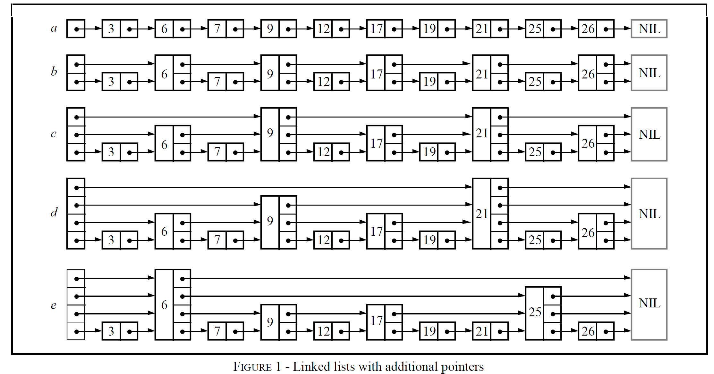

# 跳表：理论与实现
该文章描述了如今比较常用的数据结构-跳表，在leveldb、redis等项目中都能看到其身影。跳表数据结构由美国计算机科学家William Pugh 在《Skip Lists: A Probabilistic Alternative to Balanced Trees》（1990）[^1]中发表。因此理论部分主要根据这篇论文，实现为标准链表C++实现。

## 背景

二叉搜索树在随机插入的场景下能够提供很好的性能表现，而在有序插入的情况下，二叉搜索树数据结构会退化成链表，导致性能变差，多数场景下都是在线插入，想要控制插入的行为不是很现实。因此提出了二叉平衡搜索树，算法在执行操作时重新排列树，保持一定的平衡状态以提供稳定良好的性能表现。而二叉平衡搜索树算法复杂，实现和维护好都不太容易，在此背景下，William Pugh发明了跳表，以较为简单的算法实现和数据结构来代替二叉平衡搜索树，现在在许多项目中都使用跳表替代二叉搜索树结果，如leveldb、redis、kafka等。

## 跳表

考虑下图中的中的链表格式


在搜索时，最差情况下进行，假设链接长度为n，那么有按照上面结构总共为n+1个节点（包含头节点），且节点值是有序的。

+ a数据结构，需要遍历每个节点。
+ b数据结构中，链表增加第二层结构，每相隔俩个节点间有额外指针指向，最差情况需要搜索 $\lceil n/2 \rceil$ + 1个节点，这里的向上取整计算遍历节点包含头节点，+1指的是第二层链表中俩个节点中的间隔1个节点。
+ c数据结构中，在b的基础上再增加一层链表，b的第二层节点，每俩个节点增加额外的指针指向，最差的情况需要搜索 $\lceil n/4 \rceil$ + 2个节点。
+ d数据结构中，同样的在c数据结构基础上，增加一层链表，最差搜索情况为 $\lceil n / 8 \rceil$ + 3个节点

通过数学归纳法可以发现，当一个链表有类似k层数据结构，第k层中每个节点中包含第k-1层的一个节点，最终可以构造一个log2(n)层的链表结构，每次查询的时间复杂为log2(n)。这在查找时提供很快的效率，但在插入和删除的时候，要保持以上规律实现复杂度不亚于二叉搜索树的再平衡过程。

如果在插入节点时随机选择一个层级进行加入，如同e数据结构，这样在插入和删除的时候，如果操作多个链表的插入和删除比较简单可行，且再随机选择层级的时候，通过因子P来分布各个层级节点数量，从上往下，节点数量从低到高分布，来提供良好的查找性能，这样的数据结构 William Pugh 称为跳表数据结构。

## 跳表算法

节点的Node结构定义

```cpp
struct Node {
    int key;
    std::vector<Node*> forward;
   	Node(int k, int level): key(k), forward(level+1, nullptr){}
};
class SkipList {
private:
    int max_level_;
    double p_;
    int level_;
    Node* header_;
};
```

跳表中按照key值进行排序，forward是一个指针数组，指向各个层级的下一个节点，forward[i] 为第i层的下个节点。

### 跳表初始化

一开始需要确定好跳表的最大层级max_level\_，初始化时跳表为空，头节点header\_的各个层级指向下一个节点为空(header->forwar[i] = nullptr（0 <= i <= max_level\_)，当前层级level_等于0



```cpp
SkipList::SkipList(int max_level, double p)
  : max_level_(max_level),
    p_(p),
    level_(0),
    header_(new Node(-1, max_level))
  {
    srand(time(0));
  }
```


### 搜索算法

假设要查找key，跳表搜索从当前最高层级开始，每一层找到大于等于key的前驱节点，然后下一个层级继续查找，直到第0层级，判断当前节点的下一个结点是否符合目标，若符合则查找成功，否则失败。



上面是一个跳表的数据结构，层级level_为3，查找key为11的查找步骤，途中绿色方框中的数字为查找顺序。

首先从当前header->forward[level]开始，这是因为越上层的节点数量越少（这是由随机随机层级算法决定，下面进行讨论），对每个层级找到大于等于key的前驱节点，下降层级的过程是对有序数据进行分治的一个过程，逐步缩小查找的范围，最后到第0层级，判断当前节点是否与目标key是否匹配，符合则找到对应的节点，否则找不到。

### 搜索代码实现

```cpp
bool SkipList::Search(int key) {
    Node* current = header_;
    for(int i = level_; i >= 0; --i) {
        while(current->forward[i] && current->forward[i]->key < key) {
            current = current->forward[i];
        }
    }
    current = current->forward[0];
    if(current != nullptr && current->key == key) {
        return true;
    }
    return false;
}
```

### 层级随机算法

```cpp
int SkipList::RandomLevel() {
    int level = 0;
    while(rand() < p_*RAND_MAX && level < max_level_) {
        level++;
    }
    return level;
}
```

P是一个常数，假设设置为1/2，那么选择第一层的概率为1/2，第二层1/4，第三层1/8，以此类推第n层的概率为1/ $$2^{n}$$，这也是为什么搜索时是从最高层级开始逐级下降查找，层级越高，节点数量越小，俩个节点之间的key范围越大。

### 链表插入操作

回顾以下有序单链表的操作流程：遍历链表找到要插入的位置，插入节点指向下一个节点，前驱节点指向当前节点。如以下代码。

```cpp
void Insert(Node* node) {
    Node* cur = header;
    while(cur->next&&cur->next->val < node->val) {
        cur = cur->next;
    }
    node->next = cur->next;
    cur->next = node;
}
```

跳表相当于多个链表组合而成，因此需要增加一个数组prev来保存每个层级插入位置的前驱节点，这在搜索的时候保留层级下降的节点，当要插入key为8时，那么每一个层级的对应前驱节点为以下红色节点。



前驱节点查找代码，在每一个层级下降时保留当前节点到prev数据里面。

```cpp
void SkipList::Insert(int key) {
    std::vector<Node*> prev(max_level_+1, nullptr);
    Node* current = header;

    //外层循环是遍历层级，从level->0
    for(int i = level_; i >= 0; --i) {
      //嵌套while循环表示在同一层找到大于等于key的前驱节点
      while(current->forward[i] != nullptr && current->forward[i]->key < key) {
        current = current->forward[i];
      }
      //找到当前层级的前驱节点, 加入到prev数组中
      prev[i] = current;
    }
    //进行插入操作
}
```

得到前驱节点update数组后，通过 __RandomLevel__ 函数获取要插入的层级new_level。

+ 当new_level <= 当前层级level_时，只需要从层级0到new_level，将update中的前驱节点依次进行更新即可，插入节点如下面蓝色节点。



具体操作代码

```cpp
int new_level = RandomLevel();
Node* newNode = new Node(key, new_level);
for(int i = 0; i <= new_level; ++i) {
    newNode->forward[i] = prev[i]->forward[i];
    prev[i]->forward[i] = newNode;
}
```

+ 当new_level > 当前层级level_时，那么header\_[new_level]也需要指向当前插入节点，为以下蓝色部分。



具体操作代码

```cpp
int new_level = RandomLevel();
if(new_level > level_) {
    //将保存[level+1, new_level]前驱，即为header_。
    for(int i = level + 1; i <= new_level; ++i) {
        prev[i] = header;
    }
    level_ = new_level; //更新层级level_
}

Node* newNode = new Node(key, new_level);
for(int i = 0; i <= new_level; ++i) {
    newNode->forward[i] = prev[i]->forward[i];
    prev[i]->forward[i] = newNode;
}
```

将搜索update前驱节点，以及修改节点整合起来，完整的插入节点代码如下

```cpp
void SkipList::Insert(int key) {
    std::vector<Node*> prev(max_level_+1, nullptr);
    Node* current = header;

    //外层循环是遍历层级，从level->0
    for(int i = level_; i >= 0; --i) {
      //嵌套while循环表示在同一层找到大于等于key的前驱节点
      while(current->forward[i] != nullptr && current->forward[i]->key < key) {
        current = current->forward[i];
      }
      //找到当前层级的前驱节点, 加入到prev数组中
      prev[i] = current;
	}

    current = current->forward[0];
    //若找到当前节点就直接忽略，假定不会插入同个key
    if(current == nullptr || current->key != key) {
      int new_level = RandomLevel();
      if(new_level > level_) {
        for(int i = level + 1; i <= new_level; ++i) {
          prev[i] = header;
        }
        level = new_level;
      }

      Node* newNode = new Node(key, new_level);
      for(int i = 0; i <= new_level; ++i) {
        newNode->forward[i] = prev[i]->forward[i];
        prev[i]->forward[i] = newNode;
      }
	}
}
```

### 链表删除操作

删除操作和插入操作类似，同样的需要先找到所有层级的前驱节点，保存update数组中，在遍历所有前驱节点，将前驱节点指向目标节点的下一个节点，删除该节点。同样的，插入操作有可能增加当前的层级，删除操作也有可能减少当前层级，需要进行判断，并减少层级。

具体删除操作代码如下

```cpp
void SkipList::Remove(int key) {
    std::vector<Node*> prev(max_level_+1, nullptr);
    Node* current = header;
	//搜索前驱update数组
    for(int i = level_; i >= 0; --i) {
        while(current->forward[i] != nullptr && current->forward[i]->key < key) {
            current = current->forward[i];
        }
        prev[i] = current;
    }
	
    current = current->forward[0];
    if(current != nullptr && current->key == key) {
        for(int i = 0; i <= level_; ++i) {
            if(prev[i]->forward[i] != current) {
                break;
            }
            prev[i]->forward[i] = current->forward[i];
        }
        delete current;
		
        //判断是否减少层级
        while(level > 0 && header->forward[level] == nullptr) {
            level--;
        }
    }
}
```

## 总结

跳表是一种多层级有序链表结构，插入和删除容易操作和理解，且可以提供lng2(n)查询和插入复杂度，用来代替二叉平衡搜索树。

## 附：完整简单跳表代码示例C++

```cpp
#include <vector>
#include <iostream>
#include <ctime>
#include <cstdlib>

struct Node {
  int key;
  std::vector<Node*> forward;
  Node(int k, int level): key(k), forward(level+1, nullptr) {}
};

class SkipList
{
private:
  int max_level_;
  double p_;
  int level_;
  Node* header_;

  int RandomLevel() {
    int level = 0;
    while(rand() < p_*RAND_MAX && level < max_level_) {
      ++level;
    }
    return level;
  }
public:
  SkipList(int max_level, double p)
  : max_level_(max_level),
    p_(p),
    level_(0),
    header_(new Node(-1, max_level))
  {
    srand(time(0));
  }

  SkipList(const SkipList&)=delete;
  SkipList& operator=(const SkipList&)=delete;

  ~SkipList() {
    Node* current = header_;
    while(current != nullptr) {
      Node* next = current->forward[0];
      delete current;
      current = next;
    }
  }

  bool Search(int key) {
    Node* current = header_;
    for(int i = level_; i >= 0; --i) {
      while(current->forward[i] && current->forward[i]->key < key) {
        current = current->forward[i];
      }
    }

    current = current->forward[0];
    if(current && current->key == key) {
      return true;
    }
    return false;
  }

  void Insert(int key) {
    Node* current = header_;
    Node* prev[max_level_+1];

    //外层循环是遍历层级，从level->0
    for(int i = level_; i >= 0; --i) {
      //嵌套while循环表示在同一层找到大于等于key的前驱节点
      while(current->forward[i] && current->forward[i]->key < key) {
        current = current->forward[i];
      }
      //找到当前层级的前驱节点, 加入到prev数组中
      prev[i] = current;
    }

    current = current->forward[0];
    if(current == nullptr || current->key != key) {
      int new_level = RandomLevel();
      if(new_level > level_) {
        for(int i = level_ + 1; i <= new_level; ++i) {
          prev[i] = header_;
        }
        level_ = new_level;
      }

      Node* node = new Node(key, new_level);
      for(int i = 0; i <= new_level; ++i) {
        node->forward[i] = prev[i]->forward[i];
        prev[i]->forward[i] = node;
      }
    }
  }

  void Remove(int key) {
    Node* current = header_;
    Node* prev[max_level_];
    for(int i = level_; i >= 0; --i) {
      while(current->forward[i] && current->forward[i]->key < key) {
        current = current->forward[i];
      }
      prev[i] = current;
    }
    current = current->forward[0];
    if(current && current->key == key) {
      for(int i = 0; i <= level_; ++i) {
        if(prev[i]->forward[i] != current) {
          break;
        }
        prev[i]->forward[i] = current->forward[i];
      }
      delete current;
    }
    
    while(level_ && header_->forward[level_] == nullptr) {
      --level_;
    }
  }

  void Display() {
    for(int i = level_; i >= 0; --i) {
      Node* current = header_->forward[i];
      std::cout << "Level " << i << ": ";
      while(current != nullptr) {
        std::cout << current->key << " ";
        current = current->forward[i];
      }
      std::cout << std::endl;
    }
  }
};

int main() {
  SkipList sl(16, 0.5);
  sl.Insert(3);
  sl.Insert(6);
  sl.Insert(7);
  sl.Insert(9);
  sl.Insert(12);
  sl.Insert(19);
  sl.Insert(17);
  sl.Insert(26);
  sl.Insert(21);
  sl.Insert(25);
  sl.Display();

  std::cout << "Search 19: " << (sl.Search(19) ? "Found" : "Not Found") << std::endl;
  std::cout << "Search 15: " << (sl.Search(15) ? "Found" : "Not Found") << std::endl;

  sl.Remove(19);
  sl.Display();

  return 0;
}
```

## 引用
[^1]:Skip Lists: A Probabilistic Alternative to Balanced Trees 1990
