# redis 底层Dict实现
该文章主要描述了Redis中最为基础的数据结构Dict的底层实现细节。在Redis中，Dict被广泛用于各种功能中，主要用于存储键值对，以实现快速的数据访问和操作，以及介绍Dict在扩容和缩容采用渐进Reshashing的方式。

## 用途

+ 哈希类型： Redis的哈希类型（Hash)底层实现基于Dict
+ 发布/订阅模式：Dict用于存储频道和订阅者的关系
+ 过期键值管理：用于存储带有过期时间的键
+ 有序集合中(ZSet)：用于对成员和分数的映射（zscores)，以及对ZSet对成员进行去重。
+ 集合（Set)：当集合以哈希表形式实现时，应用于集合中对成员查找

## 代码位置

redis版本：redis 8.0

文件位置：头文件redis/src/dict.h 源文件redis/src/dict.c

## Dict 实现

### Dict结构体定义

```c
//file: redis/src/dict.h
struct dict {
    dictType *type;

    dictEntry **ht_table[2];
    unsigned long ht_used[2];

    long rehashidx; /* rehashing not in progress if rehashidx == -1 */

    /* Keep small vars at end for optimal (minimal) struct padding */
    unsigned pauserehash : 15; /* If >0 rehashing is paused */

    unsigned useStoredKeyApi : 1; /* See comment of storedHashFunction above */
    signed char ht_size_exp[2]; /* exponent of size. (size = 1<<exp) */
    int16_t pauseAutoResize;  /* If >0 automatic resizing is disallowed (<0 indicates coding error) */
    void *metadata[];
};
```

+ dictType *type 定义当前字典属性，以及hook函数（哈希函数，销毁值函数，rehash开始，完成回调函数等）
+ dictEntry **ht_table[2]，俩个dictEntry数组（哈希表），一般情况只有ht_table[0]指向一个dictEntry数组，存放键值对dictEntry，只有在ReHash的过程，ht_table[1]指向新的dictEntry（键值对）数组，新加的键值对直接加入到ht_table[1]中，直到ReHash完成，释放ht_table[0]，并将ht_table[1]赋值给ht_table[0]，ReHash下文会详细描述。
+ unsigned long ht_used[2];对应ht_table[2]中每个哈希表中插入的键值对数量
+ long rehashidx;当值为-1，表示没有正在ReHash过程，当值大于等于0时，表示当前正在ReHash过程中，且rehashidx表示旧 的哈希表 ht_table[0]当前遍历的下标。
+ unsigned pauserehash: 15；大于0时，暂停ReHash
+ unsigned useStoredKeyApi : 1;  值为1时使用type定义的hash，0时使用默认的哈希函数，默认为0
+ signed char ht_size_exp[2]; 哈希表大小2的指数位（如 ht_table[0]大小= 1  << ht_size_exp[0])
+ int16_t pauseAutoResize; 大于0时不允许哈希表调整大小，小于0时 表示存在错误
+ void *metadata[]; 一个可变长的数组，根据需要存储额外的信息，而不必修改字典的基本结构。

### Dict内存布局



redis中h_table[0]是一个dictEntry(键值对)指针数组，为什么不设计成图2为一个dictEntry的索引位置，指向dictEntry数组的位置，从内存布局上看，图2 dictEntry数组相比较redis指针数组有更优内存连续性，在遍历所有元素的时候直接遍历dictEntry数组。笔者认为redis怎么设计的原因是为兼容复杂的使用场景，如redis Dict设置了no_value属性时，Dict可以当作集合类型，又或是value优化存储在key中的情况。单单使用图2的形式已经不能满足上述的要求。

```Tip
图2的哈希表结构是python3.6解释器中Dict内存布局，采用开放寻址法来解决哈希值冲突，这样的设计在遍历字典时，对CPU缓存友好，可以提高性能。这对于在python代码频繁出现的for循环遍历可以带来很大的提高，当然这有其他问题，如大字典问题。有兴趣可以查阅资料。
```

### DictEntry 结构体（键值对）定义

```c
struct dictEntry {
    void *key;
    union {
        void *val;
        uint64_t u64;
        int64_t s64;
        double d;
    } v;
    struct dictEntry *next;     /* Next entry in the same hash bucket. */
};
```

+ key 指向key（字符串）
+ v，union类型，内置类型直接存储，其他复杂类型 val 指针指向
+ struct dictEntry *next; 哈希冲突时使用链地址法，next指向下一个同hash的键值对。

### 扩容

扩容的原因：Dict采用链表法方式距离哈希值冲突，当字典中的键值对数量增加多，增大哈希值冲突的概率，会给插入和查询带来性能影响（如下图所示），当遇到哈希值冲突时，都需要遍历链表对每个key进行比较。因此需要对哈希表进行扩容。



扩容需要满足以下条件：

+ 当前没有在进行rehashing过程，rehashing是Dict扩容的方式（下面会进行介绍），如果已经开始扩容了，那么就不能重复操作。

+ dict_can_resize标记为DICT_RESIZE_ENABLE 且 当前哈希表使用率达到100% 

  或者 dict_can_resize != DICT_RESIZE_FORBID 且当前哈希表使用率达到400%

```C
//file: redis/src/dict.c
/* Returning DICT_OK indicates a successful expand or the dictionary is undergoing rehashing, 
 * and there is nothing else we need to do about this dictionary currently. While DICT_ERR indicates
 * that expand has not been triggered (may be try shrinking?)*/
int dictExpandIfNeeded(dict *d) {
    /* Incremental rehashing already in progress. Return. */
    if (dictIsRehashing(d)) return DICT_OK;

    /* If the hash table is empty expand it to the initial size. */
    if (DICTHT_SIZE(d->ht_size_exp[0]) == 0) {
        dictExpand(d, DICT_HT_INITIAL_SIZE);
        return DICT_OK;
    }

    /* If we reached the 1:1 ratio, and we are allowed to resize the hash
     * table (global setting) or we should avoid it but the ratio between
     * elements/buckets is over the "safe" threshold, we resize doubling
     * the number of buckets. */
    if ((dict_can_resize == DICT_RESIZE_ENABLE &&
         d->ht_used[0] >= DICTHT_SIZE(d->ht_size_exp[0])) ||
        (dict_can_resize != DICT_RESIZE_FORBID &&
         d->ht_used[0] >= dict_force_resize_ratio * DICTHT_SIZE(d->ht_size_exp[0])))
    {
        if (dictTypeResizeAllowed(d, d->ht_used[0] + 1))
            dictExpand(d, d->ht_used[0] + 1);
        return DICT_OK;
    }
    return DICT_ERR;
}
```

dict_can_resize标记:

+ 当前进程是子进程那么dict_can_resize设置为DICT_RESIZE_FORBID，此时禁止dict resize操作，
+ 当前是主进程且存在子进程的情况（redis 执行SAVE，BGSAVE, AOF时），dict_can_resize设置为DICT_RESIZE_AVOID，尽量避免存在子进程的过程中进行rehashing。
+ 当前是主进程且没有存在子进程的情况dict_can_resize设置为DICT_RESIZE_ENABLE，允许进行rehashing

```Tip
Copy-On-Write(写时复制):是一种优化策略，主要用于在多进程或多线程环境下，共享同一块内存区域，只有在需要对这块内存进行写操作时，才会进行真正的拷贝操作。Linux 执行fork派生子进程时，父进程和子进程共享同一块内存区域，当父进程或子进程对一块内存区域进行写入时，会先分配一块新内存空间，将需要修改的部分从原来位置拷贝到新的内存空间，再进行写入。因此redis在存在子进程的时候会设置DICT_RESIZE_AVOID，减少在Copy-On-Write过程中rehashing发生内存拷贝影响性能。
```

更新dict_can_resize标记函数

```C
//file:redis/src/server.c
/* This function is called once a background process of some kind terminates,
 * as we want to avoid resizing the hash tables when there is a child in order
 * to play well with copy-on-write (otherwise when a resize happens lots of
 * memory pages are copied). The goal of this function is to update the ability
 * for dict.c to resize or rehash the tables accordingly to the fact we have an
 * active fork child running. */
void updateDictResizePolicy(void) {
    if (server.in_fork_child != CHILD_TYPE_NONE)
        dictSetResizeEnabled(DICT_RESIZE_FORBID); // 子进程不允许对字典进行扩容和缩容
    else if (hasActiveChildProcess())
        dictSetResizeEnabled(DICT_RESIZE_AVOID);  //存在子进程时避免进行扩容和缩容
    else
        dictSetResizeEnabled(DICT_RESIZE_ENABLE);
}
```

### 缩容

当Dict中键值对较少，但哈希表过大时，会影响到Dict的遍历操作的性能，遍历所有键值对时，需要扫描哈希表判断是否存在键值对，过程如下图操作所示。



因此当哈希表使用率过低时，Dict会进行缩容。

满足以下条件时Dict会进行缩容：

+ 当前没有在进行rehashing过程，如果已经开始缩容了，那么就不能重复操作。

+ dict_can_resize（同上）标记设置为DICT_RESIZE_ENABLE，且使用率小于 1/8

  或者 dict_can_resize != DICT_RESIZE_FORBID 且使用率小于 1/32 开始缩容操作，dict_can_resize这里标记作用同上，减少Copy-On-Write期间进行缩容影响性能。

```C
//file: redis/src/dict.c
/* Returning DICT_OK indicates a successful shrinking or the dictionary is undergoing rehashing, 
 * and there is nothing else we need to do about this dictionary currently. While DICT_ERR indicates
 * that shrinking has not been triggered (may be try expanding?)*/
int dictShrinkIfNeeded(dict *d) {
    /* Incremental rehashing already in progress. Return. */
    if (dictIsRehashing(d)) return DICT_OK;
    
    /* If the size of hash table is DICT_HT_INITIAL_SIZE, don't shrink it. */
    if (DICTHT_SIZE(d->ht_size_exp[0]) <= DICT_HT_INITIAL_SIZE) return DICT_OK;

    /* If we reached below 1:8 elements/buckets ratio, and we are allowed to resize
     * the hash table (global setting) or we should avoid it but the ratio is below 1:32,
     * we'll trigger a resize of the hash table. */
    if ((dict_can_resize == DICT_RESIZE_ENABLE &&
         d->ht_used[0] * HASHTABLE_MIN_FILL <= DICTHT_SIZE(d->ht_size_exp[0])) ||
        (dict_can_resize != DICT_RESIZE_FORBID &&
         d->ht_used[0] * HASHTABLE_MIN_FILL * dict_force_resize_ratio <= DICTHT_SIZE(d->ht_size_exp[0])))
    {
        if (dictTypeResizeAllowed(d, d->ht_used[0]))
            dictShrink(d, d->ht_used[0]);
        return DICT_OK;
    }
    return DICT_ERR;
}
```

###　渐进式Rehashing

+ Rehashing的原因：当字典中的键值对数量增加多，哈希冲突概率变高影响哈希表性能，而当键值对数量减少而哈希表过大，影响遍历的性能，对此redis需要在适当的时候对哈希表进行扩容和缩容。

+ 渐进式Rehashing：

  + redis在对哈希表进行扩容和缩容的时候，先将新分配的哈希表赋值给has_table[1]，并设置rehashidx为0

    ```c
    //file: redis/src/dict.c
    int _dictResize(dict *d, unsigned long size, int* malloc_failed)
    {
        //....分配新的哈希表
        d->ht_size_exp[1] = new_ht_size_exp;
        d->ht_used[1] = new_ht_used;
        d->ht_table[1] = new_ht_table;
        d->rehashidx = 0;
        //...
    }
    ```

  + 每次执行执行查询，删除操作时，如果当前键值对还没有rehash操作，那么优先进行rehash操作，这样的选择对CPU Cache局部性更优化，先rehash，后续访问大概率在CPU cache。如果当前键值对已经rehash了，那么只对下一个旧键值对进行rehash

    ```c
    //file: redis/src/dict.c
    static void _dictRehashStepIfNeeded(dict *d, uint64_t visitedIdx) {
        if ((!dictIsRehashing(d)) || (d->pauserehash != 0))
            return;
        /* rehashing not in progress if rehashidx == -1 */
        if ((long)visitedIdx >= d->rehashidx && d->ht_table[0][visitedIdx]) {
            /* If we have a valid hash entry at `idx` in ht0, we perform
             * rehash on the bucket at `idx` (being more CPU cache friendly) */
            _dictBucketRehash(d, visitedIdx); //指定当前访问先rehash
        } else {
            /* If the hash entry is not in ht0, we rehash the buckets based
             * on the rehashidx (not CPU cache friendly). */
            dictRehash(d,1); //rehash 一个旧键值对，或者遍历10个空指针。
        }
    }
    ```

  + 当全部旧键值对都rehash结束时，释放旧的哈希表ht_table[0]，将新表ht_table[1]赋值给ht_table[0]，并设置rehashidx = -1表示rehash过程结束

    ```C
    //file: redis/src/dict.c
    /* This checks if we already rehashed the whole table and if more rehashing is required */
    static int dictCheckRehashingCompleted(dict *d) {
        if (d->ht_used[0] != 0) return 0;
        
        if (d->type->rehashingCompleted) d->type->rehashingCompleted(d);
        zfree(d->ht_table[0]);
        /* Copy the new ht onto the old one */
        d->ht_table[0] = d->ht_table[1];
        d->ht_used[0] = d->ht_used[1];
        d->ht_size_exp[0] = d->ht_size_exp[1];
        _dictReset(d, 1);
        d->rehashidx = -1;
        return 1;
    }
    ```

  + 上面当每次执行操作时都对一个键值对进行Rehash，这可能出现Dict一直处于在Rehashing阶段， 为此redis加入定时主动rehash操作

    redis.conf配置文件中activerehashing设置为yes时（默认为yes) 且 redis 服务空闲时会主动对还没rehashing完成字典对象进行rehashing。

    ```C
    //file: redis/src/kvstore.c
    /* Our hash table implementation performs rehashing incrementally while
     * we write/read from the hash table. Still if the server is idle, the hash
     * table will use two tables for a long time. So we try to use threshold_us
     * of CPU time at every call of this function to perform some rehashing.
     *
     * The function returns the amount of microsecs spent if some rehashing was
     * performed, otherwise 0 is returned. */
    uint64_t kvstoreIncrementallyRehash(kvstore *kvs, uint64_t threshold_us) {
        if (listLength(kvs->rehashing) == 0)
            return 0;
    
        /* Our goal is to rehash as many dictionaries as we can before reaching threshold_us,
         * after each dictionary completes rehashing, it removes itself from the list. */
        listNode *node;
        monotime timer;
        uint64_t elapsed_us = 0;
        elapsedStart(&timer);
        //遍历正在rehash的字典对象
        while ((node = listFirst(kvs->rehashing))) {
            dictRehashMicroseconds(listNodeValue(node), threshold_us - elapsed_us);
    
            elapsed_us = elapsedUs(timer);
            if (elapsed_us >= threshold_us) {
                break;  /* Reached the time limit. */
            }
        }
        return elapsed_us;
    }
    ```

    kvs->rehashing是一个链表结构，每当Dict开始执行Rehasing时，会将Dict添加到kvs->rehashing链表中。

    threshold_us 为每次执行Rehashing设置超时时间，超过等下一个空闲再主动执行rehashing

## 总结

+ Dict底层采用哈希表实现，使用链地址法解决哈希值冲突问题。
+ 当Dict使用率过大或过小会影响性能，使用渐进式Rehashing的方式来进行扩容和缩容
