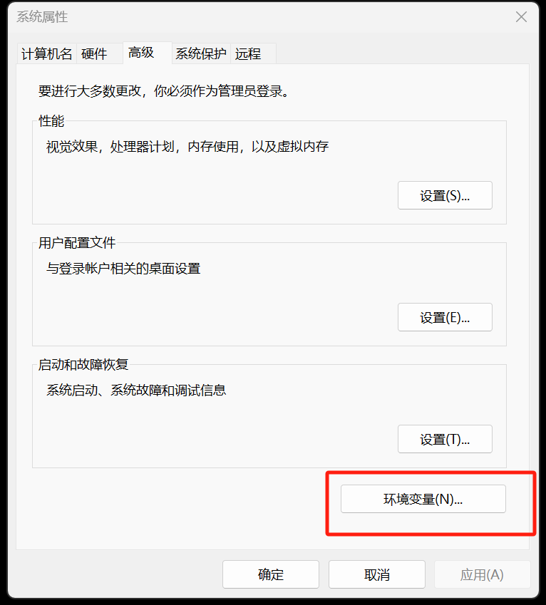

# Windows11 qemu 使用
windows平台下的vmware不支持架构虚拟化，因此想要在x64架构下模拟其他架构如ARM，需要使用qemu进行虚化实现，该文章描述在windows11上使用qemu安装arm架构的ubuntu系统详细过程。
## Windows qemu 安装
### qemu下载地址

[QEMU for Windows – Installers (64 bit)](https://qemu.weilnetz.de/w64/)

### 安装qemu


​	配置选择安装路径，后续需要将这路径加入到系统环境变量中

### 配置qemu环境变量

右击电脑选择属性 -- 高级配置 -- 环境变量



在系统变量中选择Path变量点编辑，这个Path是在控制台执行命令时的查找路径， 把安装的qemu路径新加到Path中


​								
​	安装完打开cmd控制台确认路径生效，输出版本信息


## 使用qemu模拟 arm架构

### windows 配置虚拟网卡

虚拟网卡是虚拟机与主机外部网络之间的桥梁，一般会采用NAT模式或桥接模式

+ NAT：虚拟机可以通过NAT（网络地址转换）访问外部网络，当外部网络无法直接访问虚拟机。
+ TAP设备 桥接模式：虚拟机可以获得一个所在局域网IP地址，与宿主机和外部网络直接通信。

这里采用桥接模式，需要在windows上创建一个tap虚拟网卡，安装以下软件自己自动创建虚拟网卡，也可以选择其他软件

[OpenVPN Connect - VPN For Your Operating System | OpenVPN](https://openvpn.net/client/)

安装完打开 网络和Internet设置 -> 高级网络配置，可以看到如下图网络设配置多了TAP设置，在这里更名为tap0，为了后续方便指定设备


将tap0和可以上网的网卡进行桥接，这里使用WLAN进行上网，因此将tap0和WLAN进行桥接，会多出来一个网桥接口，如下图所示。


到这虚拟网卡和主机网络这一部分就配置好，接下来需要安装虚拟机。

::: info
按照其他方式如在WLAN网卡中选择和tap0共享网络的方式，实践中只能实现主机和虚拟机互通，但不能上网，要创建网桥前，需要将之前设置的共享取消。
:::

### qemu 安装虚拟机

#### Ubuntu ARM 和 引导UEFI 固件下载

测试使用qemu安装arm架构的Ubuntu系统，需要下载

+ UEFI固件 系统安装引导 [Linaro Releases](https://releases.linaro.org/components/kernel/uefi-linaro/16.02/release/qemu64/) 选择QEMU_EFI.fd进行下载

+ 操作系统 Ubuntu 24.04.1 LTS [Ubuntu ARM版下载 | Ubuntu](https://cn.ubuntu.com/download/server/arm)

#### 创建虚拟机镜像

```powershell
qemu-img.exe create -f qcow2 ubuntu24.04_arm.qcow2 30G
```

+ -f qcow2 使用 `qcow2` 格式的磁盘镜像可以提高性能，并支持压缩和快照。

+ ubuntu24.04_arm.qcow2 镜像文件名

+ 30G 指定镜像大小为30G	

#### 创建虚拟机

```powershell
chcp 65001 # 设置控制台utf-8编码
qemu-system-aarch64.exe -m 8192 ^
-cpu cortex-a72 -smp 8,sockets=4,cores=2 -M virt ^
-bios "D:\virtual_machine\qemu\ubuntu\QEMU_EFI.fd" ^
-device VGA -device nec-usb-xhci -device usb-mouse -device usb-kbd ^
-drive file="D:\virtual_machine\qemu\ubuntu\ubuntu24.04_arm.qcow2",format=qcow2,if=none,id=hd0 ^
-device virtio-blk-device,drive=hd0 ^
-drive if=none,file="D:\virtual_machine\os_image\ubuntu-24.04.1-live-server-arm64.iso",id=cdrom,media=cdrom ^
-device virtio-scsi-device -device scsi-cd,drive=cdrom ^
-net nic -net tap,ifname=tap0
```

+ -m 8192 指定虚拟机内存大小 8192M

+ -cpu cortex-a72 执行cpu型号为ARM Cortex-A72 CPU模型， -smp 配置多核CPU，这里配置8核心， socket=4 为4个cpu插槽,  每个CPU插槽有2个核心

  -M 指定虚拟机的机器类型，virt QEMU提供的ARM虚拟机类型，支持UEFI和PCI设置

+ -bios 执行虚拟机的BIOS文件，这里指定刚才下载的ubuntu 的 EFI文件

+ -device VGA -device nec-usb-xhci -device usb-mouse -device usb-kbd 添加VGA显卡，usb 鼠标 usb键盘

+ -drive file="D:\virtual_machine\qemu\ubuntu\ubuntu24.04_arm.qcow2",format=qcow2,if=none,id=hd0

​	将上面创建的虚拟镜像配置为虚拟机的硬盘，并分配id为hd0

+ -device virtio-blk-device,drive=hd0 使用virtio块设备，绑定到上一步定义的hd0硬盘，__需要注意除了-device后面带一个空格外，参数之间是没有空格的__
+ -drive if=none,file=D:\virtual_machine\os_image\ubuntu-24.04.1-live-server-arm64.iso,id=cdrom,media=cdrom 

​	指定ubuntu系统镜像盘位置，指定设备类型为cdrom

+ -device virtio-scsi-device -device scsi-cd,drive=cdrom 模拟一个SCSI光盘设备并绑定到上面的类型cdrom上
+ -net nic -net tap,ifname=tap0 为虚拟机添加一个网络接口卡（NIC)，使用TAP设备连接虚拟机和主机的网络，这里指定名称为上面修改tap设备的名称一致。


#### Ubuntu 安装

这里配置Ubuntu的系统配置跟正常一样，只需要按照指引进行配置即可。


#### 配置虚拟机网络

查看宿主机的ip配置，找到刚才创建的网桥，这里配置192.168.3.50和网关是192.168.3.1。虚拟机网络id地址应该在该子网下，且网关需要配置相同。


这里给出Ubuntu网络配置文件，配置ip地址192.168.3.41，网关地址为192.168.3.1。

sudo vi /etc/netplan/xxx.yaml 网络配置文件。

```sh
 network:
   version: 2
   renderer: networkd
   ethernets:
     enp0s1: # 指定网卡名称， ip a 可以查看对应的网卡名称
       addresses:
         - 192.168.3.41/24
       routes:
         - to: default # 默认流量走192.168.3.1
           via: 192.168.3.1
       nameservers:
           search: [mydomain, otherdomain]
           addresses: [114.114.114.114, 8.8.8.8]
```

sudo netplan apply 使配置生效

验证虚拟机到宿主机，虚拟机到外部网络的连通性


验证宿主机到虚拟机的网络


#### 配置启动脚本

创建run.bat脚本，将以下指令添加到脚本中

```powershell
qemu-system-aarch64.exe -m 8192 ^
-cpu cortex-a72 -smp 8,sockets=4,cores=2 -M virt ^
-bios "D:\virtual_machine\qemu\ubuntu\QEMU_EFI.fd" ^
-device VGA -device nec-usb-xhci -device usb-mouse -device usb-kbd ^
-drive file="D:\virtual_machine\qemu\ubuntu\ubuntu24.04_arm.qcow2",format=qcow2,if=none,id=hd0 ^
-device virtio-blk-device,drive=hd0 ^
-net nic -net tap,ifname=tap0
```

至此qemu的安装和配置就基本完成。

## 问题

1. 未能识别到磁盘，或磁盘空间不足问题，可能系统不能识别cpow2的稀疏映像，将cpow2格式改为raw格式

```powershell
qemu-img.exe create ubuntu24.04_arm.raw 30G
```

将创建虚拟机对应的指令也进行修改

```powershell
chcp 65001 # 设置控制台utf-8编码
qemu-system-aarch64.exe -m 8192 ^
-cpu cortex-a72 -smp 8,sockets=4,cores=2 -M virt ^
-bios "D:\virtual_machine\qemu\ubuntu\QEMU_EFI.fd" ^
-device VGA -device nec-usb-xhci -device usb-mouse -device usb-kbd ^
-drive file="D:\virtual_machine\qemu\ubuntu24.04_arm.raw",format=raw,if=none,id=hd0 ^
-device virtio-blk-device,drive=hd0 ^
-drive if=none,file="D:\virtual_machine\os_image\ubuntu-24.04.1-live-server-arm64.iso",id=cdrom,media=cdrom ^
-device virtio-scsi-device -device scsi-cd,drive=cdrom ^
-net nic -net tap,ifname=tap0
```

2. Ubuntu 安装完点重启后没有反应，直接关闭，将挂载的ios驱动去掉，直接使用启动脚本再次启动就行

3. 网络异常问题。

   + 启动虚拟机和检查网桥的状态，检查tap0状态是否已经变为已启用，否则查看qemu启动参数是net配置是否正确。

    
  + 当状态正常时， 检查虚拟机的网络配置，ip route 检查网关地址是否跟宿主机一致。 ping 宿主机网关进行检查。

   + 虚拟机和宿主机能互联，但不能访问外部网络，查看dns配置是否正确，可以先ping 一个外部的ip地址，如果能ping通则dns配置错误修改即可。

