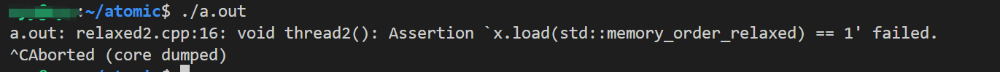

## 摘要
该文章主要介绍C++atomic库，atomic是对不同CPU架构内存序操作的封装，意指提供一个统一的操作接口，以及对应内存序模型。

对应介绍了atomic库中六种内存序，以及对应的内存序模型例子讲解。

# C++并发设计：背景基础知识-C++内存模型（atomic）
## 前言
+ 该文章主要介绍C++atomic内存的使用，对于内存序的内容以及背后的原理在这一篇文章有进行详细介绍 [深入理解内存序](./C++并发设计：背景基础知识-深入理解内存序.md),以下内容假定读者已经对内存序有一定了解。
+ 代码实验：由于不同架构对于内存序的限制是不一样的，这会导致同样的代码在不同架构平台会出现行为不一样的现象，作为实验, 选择宽松内存序架构作为环境，目前最为宽松的内存序架构Alpha已经没落，这里使用ARM架构作为实验测试环境，若没有云服务器或arm架构的测试服务器，可以参考[windows qemu的使用](../tool/qemu的使用.md)文章在windows上虚拟ARM架构并安装系统进行测试。

## 测试环境
+ 在windows11上使用qemu模拟 ARM架构
+ 操作系统 uname -a：Linux cyy 6.8.0-41-generic #41-Ubuntu SMP PREEMPT_DYNAMIC Fri Aug  2 23:26:06 UTC 2024 aarch64 aarch64 aarch64 GNU/Linux
## 六种内存序
+ memory_order_relaxed

  只保证操作的原子性，不提供任何同步或顺序保证
+ memory_order_release

  确保当前线程在 __之前__ 读取和写入不会被重排到当前写入操作之后
+ memory_order_acquire

  确保当前线程在 __之后__ 读取和写入操作不会被重排到当前读取操作之前，且对于在这之前其他线程memory_order_release写入操作（同个共享变量）以及在这之前的写入操作可见。
+ memory_order_consume

  ​确保当前线程在 __之后依赖__ 该加载结果的操作不会被重新排序到加载操作之前，且对于在这之前其他线程memory_order_release写入操作（同个共享变量）以及在这之前的 __依赖写入__ 可见，比memory_order_acquire内存序弱 

+ memory_order_acq_rel

  获取-释放操作。结合了memory_order_acquire和memory_order_release特性。
  ​确保在当前线程，当前操作之前所有读写操作不会被重排到之后，当前操作之后的读写操作不会被重排到之前，适用于需要同时进行获取和释放操作的场景，如自旋锁。

+ memory_order_seq_cst

  ​	全局顺序一致性操作，提供最强的内存顺序保证，默认内存序。

  ​	确保 __所有线程__ 看到的操作顺序是一致的，即存在一个全局的操作顺序，所有线程都按照这个顺序致性。

## 对应示例

### memory_order_relaxed

宽松内存序，只保证操作原子性，不保证同步和顺序。

```C++
#include <atomic>
#include <cassert>
#include <thread>

std::atomic<int> x{0};
std::atomic<int> y{0};

void thread1() {
  x.store(1, std::memory_order_relaxed);
  y.store(1, std::memory_order_relaxed);
}

void thread2() {
  while(y.load(std::memory_order_relaxed) == 0);
  assert(x.load(std::memory_order_relaxed) == 1); //failed;
}

int main() {
  std::thread t1(thread1);
  std::thread t2(thread2);
  t1.join();
  t2.join();
  return 0;
}
```

以上代码有可能出现以下执行情况：

+ thread1 y.store(1, std::memory_order_relaxed) 重排在 x.store(1, std::memory_order_relaxed)之前。
+ thread2 不能保证其他线程操作顺序，对当前线程可见。也就是说即使thread1，没有发生重新排序，x.store(1, std::memory_order_relaxed)在y.store(1, std::memory_order_relaxed)之前，y.load(std::memory_order_relaxed) == 1时，x.load(std::memory_order_relaxed)依然可能加载到旧值0。

在ARM架构上Ubuntu-arm测试结果，因为重排导致x加载到0值，断言失败。

### Release-Acquire Ordering

释放-获取内存序[^1]，这是一种在实践中最常用到的模型，如单生产单消费者无锁队列/buffer（folly/SPSCProducerComsuer)，无锁跳表（leveldb)等。

```C++
#include <atomic>
#include <cassert>
#include <string>
#include <thread>

std::atomic<std::string*> ptr;
int data;

void producer()
{
  std::string* p = new std::string("Hello");
  data = 4;
  ptr.store(p, std::memory_order_release);
}

void consumer()
{
  std::string* p2;
  while(!(p2 = ptr.load(std::memory_order_acquire)));
  assert(*p2 == "Hello"); // never fires
  assert(data == 42); // never fires
}

int main()
{
  std::thread t1(producer);
  std::thread t2(consumer);
  t1.join();
  t2.join();
}
```

memory_order_release，会保证之前的读写操作不会重排到ptr.store(p, std::memory_order_release)之后，producer线程的执行顺序

1. std::string* p = new std::string("Hello") 和 data = 4的执行顺序有可能进行重排
2. 执行上面俩个写入操作后，再执行ptr.store(p, std::memory_order_release)

memory_order_acquire，保证之后的读写操作不会重排到 ptr.load(std::memory_order_acquire)之前，且对于在之前producer线程执行的ptr.store(p, std::memory_order_release)和之前的写入操作是可见的。也就是说，当consumer线程ptr.load(std::memory_order_acquire)读取到非空值时，data必定等于4。

### Release-Consume Ordering

释放-消费内存序，比释放-获取内存序要弱，强调依赖关系。

代码示例[^2]

```C++
#include <atomic>
#include <cassert>
#include <string>
#include <thread>

int n = 0, m = 0;
std::atomic<int*> p{nullptr};

void thread1() {
  n = 1;
  m = 1;
  p.store(&n, std::memory_order_release);
}

void thread2() {
  int *t = nullptr;
  while(!(t = p.load(std::memory_order_acquire)));
  assert(*t == 1 && m == 1); // never failed
}

void thread3() {
  int *t = nullptr;
  while(!(t = p.load(std::memory_order_consume)));
  assert(*t == 1 && m == 1); // failed
}

int main() {
  std::thread t1(thread1);
  std::thread t2(thread2);
  std::thread t3(thread3);
  t1.join();
  t2.join();
  t3.join();
  return 0;
}
```

thread1 memory_order_release 操作保证了 n = 1, m = 1 在 p.store(&n,  std::memory_order_release);

thread2 memory_order_acquire 保证在读取到t的值不为nullptr时，退出循环对n = 1, m = 1的可见性，assert(*t == 1 && m == 1)恒为真。

thread3 memory_order_consume 在读取到p的值不为nullptr时，退出循环只保证对于p相关的值n=1操作的可见性，不能保证m==1。

### Sequentially-consistent ordering

使用memory_order_seq_cst内存顺序是 __默认内存__，保证全局顺序一致性，不仅保证了acquire-release语义的内存序，且对所有线程的可见顺序是一致的。

acquire-release语义只作用于相对线程：执行acquire线程限制当前线程重排，且限制顺序操作对release操作的线程是可见的，反过来执行了release线程限制当前线程操作顺序同样对于acquire线程是可见的。

全局顺序一致性：假设有四个线程分别执行在CPU1，CPU2， CPU3，CPU4，当CPU2 执行操作 A，CPU3执行操作B，A在B之前，那么对于其他俩个线程可见顺序同样是A先于B，假设没有使用memory_order_seq_cst限制，那么有可能在CPU1中看到A先于B，而在CPU4中看到B先于A的情况，如以下图：



如上图所示可能因CPU核心的距离关系，导致接收到操作顺序不一致的情况，在这种情况下需要使用memory_order_seq_cst，来保持全局操作一致性，使得CPU1和CPU4看到的顺序是一致的。

代码例子[^1]，如果将下面的memory_order_seq_cst换成acquire-release语义时，是不能保证assert(z.load() != 0)成立。

```C++
#include <atomic>
#include <cassert>
#include <thread>
 
std::atomic<bool> x = {false};
std::atomic<bool> y = {false};
std::atomic<int> z = {0};
 
void write_x()
{
    x.store(true, std::memory_order_seq_cst);
}
 
void write_y()
{
    y.store(true, std::memory_order_seq_cst);
}
 
void read_x_then_y()
{
    while (!x.load(std::memory_order_seq_cst))
        ;
    if (y.load(std::memory_order_seq_cst))
        ++z;
}
 
void read_y_then_x()
{
    while (!y.load(std::memory_order_seq_cst))
        ;
    if (x.load(std::memory_order_seq_cst))
        ++z;
}
 
int main()
{
    std::thread a(write_x);
    std::thread b(write_y);
    std::thread c(read_x_then_y);
    std::thread d(read_y_then_x);
    a.join(); b.join(); c.join(); d.join();
    assert(z.load() != 0); // will never happen
}
```


## 总结

+ atomic库统一了不同架构对于内存序的操作，提供跨平台的便利性。
+ 可以使用acquire/release实现单生产者单消费者无锁队列。

+ 对于需要全局保持顺序一致性要求，使用memory_order_seq_cst内存序来进行保证。

## 引用

[^1]:[std::memory_order - cppreference.com](https://en.cppreference.com/w/cpp/atomic/memory_order#Relaxed_ordering)
[^2]:[Atomic/GCCMM/AtomicSync - GCC Wiki](https://gcc.gnu.org/wiki/Atomic/GCCMM/AtomicSync)
