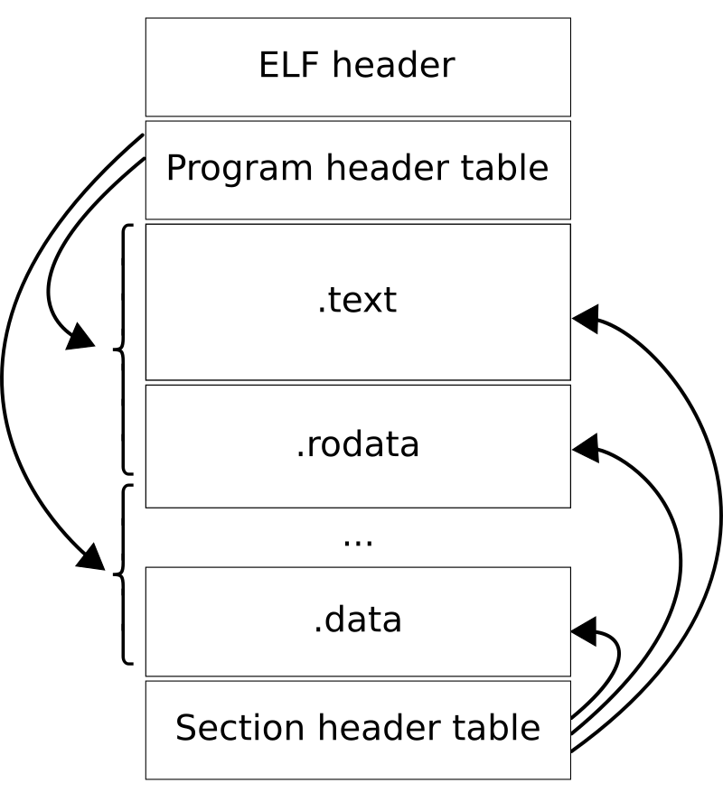

# ELF格式与解析

## ELF 简介

在计算机中，可执行和链接格式（Executable and Linkable Format, ELF)，以前被称为可拓展链接格式（Extensible Linking Format)，是可执行文件、目标文件、共享库和核心转储的通用标准格式[^1]。

## ELF 文件格式

一个ELF文件由以下三部分组成：

+ 一个ELF头（ELF header)-描述文件类型和属性，包含程序头表和节头表的属性（偏移量、数量、大小）。
+ 程序头表(Program header table)-所有有效的段(segments)和他们的属性(类型，偏移量，大小等）。
+ 节头表(Section header table)-包含对节(sections)的描述(类型，偏移量，大小等）。

​    

​					图片来源：[Executable and Linkable Format - Wikipedia](https://en.wikipedia.org/wiki/Executable_and_Linkable_Format#File_layout)

## ELF header

```C
//file: usr/include/elf.h
typedef struct
{
  unsigned char	e_ident[EI_NIDENT];	/* Magic number and other info */
  Elf64_Half	e_type;			/* Object file type */
  Elf64_Half	e_machine;		/* Architecture */
  Elf64_Word	e_version;		/* Object file version */
  Elf64_Addr	e_entry;		/* Entry point virtual address */
  Elf64_Off	e_phoff;		/* Program header table file offset */
  Elf64_Off	e_shoff;		/* Section header table file offset */
  Elf64_Word	e_flags;		/* Processor-specific flags */
  Elf64_Half	e_ehsize;		/* ELF header size in bytes */
  Elf64_Half	e_phentsize;		/* Program header table entry size */
  Elf64_Half	e_phnum;		/* Program header table entry count */
  Elf64_Half	e_shentsize;		/* Section header table entry size */
  Elf64_Half	e_shnum;		/* Section header table entry count */
  Elf64_Half	e_shstrndx;		/* Section header string table index */
} Elf64_Ehdr;
```

+ e_indent：elf文件标识
+ e_type
  + ET_NONE：未知类型
  + ET_REL：可重定位文件
  + ET_EXEC：可执行文件
  + ET_DYN：共享目标文件
  + ET_CORE：核心转储文件
+ e_machine：架构类型 EM_X86_64：x86_64架构 EM_AARCH64：AArch64架构。
+ e_version：文件版本，通常为EV_CURRENT。
+ e_entry：入口地址，程序的入口地址，操作系统会跳转到该地址开始执行。
+ e_phoff：程序头表在文件中的偏移量，从文件开头开始计算。
+ e_shoff：节区头表在文件中的偏移量，从文件开头开始计算。
+ e_flags：处理器特定的标志，用于存储架构相关的附加信息。
+ e_ehsize：ELF头的大小，通常为64字节
+ e_phentsize：程序头表中每个条目的大小，通常为56字节。
+ e_phnum：程序投标中条目数量。
+ e_shentsize：节区头表中每个条目的大小，通常为64字节。
+ e_shnum：节区头表中的条目数量。
+ e_shstrndx：节区头表字符串表索引，用于存储节区名称。

## ELF Program header

```C
//file: usr/include/linux/elf.h
typedef struct elf64_phdr {
  Elf64_Word p_type;
  Elf64_Word p_flags;
  Elf64_Off p_offset;		/* Segment file offset */
  Elf64_Addr p_vaddr;		/* Segment virtual address */
  Elf64_Addr p_paddr;		/* Segment physical address */
  Elf64_Xword p_filesz;		/* Segment size in file */
  Elf64_Xword p_memsz;		/* Segment size in memory */
  Elf64_Xword p_align;		/* Segment alignment, file & memory */
} Elf64_Phdr;
```

+ p_type 指定段的类型
  + PT_NULL：空段，不包含任何信息。
  + PT_LOAD: 可加载段，包含程序运行时需要加载到内存中代码或数据。
  + PT_DYNAMIC：动态链接信息段，包含动态链接器需要的信息。
  + PT_INTERP：解释器段，包含动态链接器的路径。
  + PT_NOTE：注释段，包含辅助信息。
  + PT_SHLIB：保留段，未使用
  + PT_PHDR：程序头表段，包含程序头表本身的描述。
  + PT_TLS：线程局部存储段，包含线程局部存储信息。
+ p_flags：段标志 PF_X：可执行，PF_W：可写，PF_R：可读，PF_MASKPROC：处理器特定的标志
+ p_offset：段文件偏移，从文件开头开始计算。
+ p_vaddr：段虚拟地址，段在内存中的虚拟地址，程序运行时加载到该地址。
+ p_paddr：段物理地址，段在内存中的物理地址，通常与p_vaddr相同。
+ p_filesz：段文件大小，段在文件中的大小，从p_offset开始计算。
+ p_memsz：段内存大小，可能大于p_filesz，因为某些段在内存中可能需要额外初始化或填充。
+ p_align：段对齐，段在文件和内存中的对齐要求。通常为2的幂，例如4096标识段必须在4096字节的边界上对齐。

## Section header

```C
//file: usr/include/linux/elf.h
typedef struct elf64_shdr {
  Elf64_Word sh_name;		/* Section name, index in string tbl */
  Elf64_Word sh_type;		/* Type of section */
  Elf64_Xword sh_flags;		/* Miscellaneous section attributes */
  Elf64_Addr sh_addr;		/* Section virtual addr at execution */
  Elf64_Off sh_offset;		/* Section file offset */
  Elf64_Xword sh_size;		/* Size of section in bytes */
  Elf64_Word sh_link;		/* Index of another section */
  Elf64_Word sh_info;		/* Additional section information */
  Elf64_Xword sh_addralign;	/* Section alignment */
  Elf64_Xword sh_entsize;	/* Entry size if section holds table */
} Elf64_Shdr;
```

+ sh_name：节区名称的索引，该索引指向节区头表字符串表（.strtab）中的一个字符串。
+ sh_type：节区类型
  + SHT_NULL：空节区，不包含任何信息。
  + SHT_PROGBITS：程序定义的节区，包含代码或数据。
  + SHT_SYMTAB：符号表，包含符号信息
  + SHT_STRTAB：字符串表，包含字符串信息，各个section的名称信息。
  + SHT_RELA：重定位表，包含重定位信息。
  + SHT_HASH：符号哈希表，用于快速查找符号。
  + SHT_DYNAMIC：动态链接信息表，包含动态链接器需要的信息。
  + SHT_NOTE：注释节区，包含辅助信息。
  + SHT_NOBITS：未初始化的节区，不占用文件空间，但占用内存空间。
  + SHT_REL：重定位表，包含重定位信息。
  + SHT_SHLIB：保留节区，未使用。
  + SHT_DYNSYM：动态符号表，包含动态链接器需要的符号信息。
+ sh_flags: 节区标志
  + SHF_WRITE：节区可写。
  + SHF_ALLOC：节区在内存中分配。
  + SHF_EXECINSTR：节区包含可执行指令。
  + SHF_MERGE：节区可以合并。
  + SHF_STRINGS：节区包含字符串。
  + SHF_INFO_LINK：sh_info 字段包含节区索引。
  + SHF_LINK_ORDER：节区有链接顺序要求。
  + SHF_OS_NONCONFORMING：节区包含操作系统特定信息。
  + SHF_GROUP： 节区属于一个组。
  + SHF_TLS：节区包含线程局部存储信息。
+ sh_addr：节区在内存中的虚拟地址，程序运行时加载到该地址。
+ sh_offset：节区在文件中的便宜i，从文件开头开始计算。
+ sh_size：节区大小，以字节为单位。
+ sh_link：关联的另一个节区的索引，通常用于符号表和重定位表。
+ sh_info：附加信息，对于符号表，sh_info表示符号表的条目数。
+ sh_addralign：节区在文件和内存中的对齐要求。通常为2的幂。
+ sh_entsize：条目大小。如果节区包含表（如符号表或重定位表），则表示每个条目的大小。其他值为0。

## ELF 解析

安装libelf库 Ubuntu： sudo apt install libelf-dev

#### 提取PROGBITS Section的指令


## 工具

常用的ELF文件分析工具：

### readelf

+ readelf -S filename 查看各个section headers的信息

  ```text
  root@root:~/hello_world$ readelf -Sn hello_world.ebpf.o 
  There are 6 section headers, starting at offset 0xf0:
  
  Section Headers:
    [Nr] Name              Type             Address           Offset
         Size              EntSize          Flags  Link  Info  Align
    [ 0]                   NULL             0000000000000000  00000000
         0000000000000000  0000000000000000           0     0     0
    [ 1] .strtab           STRTAB           0000000000000000  00000099
         0000000000000051  0000000000000000           0     0     1
    [ 2] .text             PROGBITS         0000000000000000  00000040
         0000000000000000  0000000000000000  AX       0     0     4
    [ 3] ksyscall/execve   PROGBITS         0000000000000000  00000040
         0000000000000010  0000000000000000  AX       0     0     8
    [ 4] .llvm_addrsig     LOOS+0xfff4c03   0000000000000000  00000098
         0000000000000001  0000000000000000   E       5     0     1
    [ 5] .symtab           SYMTAB           0000000000000000  00000050
         0000000000000048  0000000000000018           1     2     8
  Key to Flags:
    W (write), A (alloc), X (execute), M (merge), S (strings), I (info),
    L (link order), O (extra OS processing required), G (group), T (TLS),
    C (compressed), x (unknown), o (OS specific), E (exclude),
    D (mbind), p (processor specific)
  ```

+ objdump 反汇编和查看节信息
+ nm 查看符号表
+ ldd 查看共享库依赖

## 引用

[^1]:[Executable and Linkable Format - Wikipedia](https://en.wikipedia.org/wiki/Executable_and_Linkable_Format)

